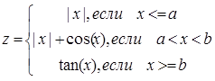

МИНИСТЕРСТВО НАУКИ  И ВЫСШЕГО ОБРАЗОВАНИЯ РОССИЙСКОЙ ФЕДЕРАЦИИ  
Федеральное государственное автономное образовательное учреждение высшего образования  
"КРЫМСКИЙ ФЕДЕРАЛЬНЫЙ УНИВЕРСИТЕТ им. В. И. ВЕРНАДСКОГО"  
ФИЗИКО-ТЕХНИЧЕСКИЙ ИНСТИТУТ  
Кафедра компьютерной инженерии и моделирования
<br/><br/>
### Отчёт по лабораторной работе № 2<br/> по дисциплине "Программирование"
<br/>

студентки 1 курса группы ИВТ-192(1)  
<br/>Николаевой Владимиры Григорьевны
<br/>направления подготовки 09.03.01 "Информатика и вычислительная техника" 

<br/><br/>
<table>
<tr><td>Научный руководитель<br/> старший преподаватель кафедры<br/> компьютерной инженерии и моделирования</td>
<td>(оценка)</td>
<td>Чабанов В.В.</td>
</tr>
</table>
<br/><br/>

Симферополь, 2019

### Цель
* Овладеть практическими навыками разработки и программирования вычислительного процесса циклической структуры;

* Сформировать навыков программирования алгоритмов разветвляющейся структуры;

* Изучить операторы ветвления. Особенности использования полной и сокращенной формы оператора `if` и тернарного оператора.

<br/><br/>
### Ход работы

1. Создаём программу, которая для функции **f(x)** выведет её значение с шагом **dx** , а так же определит максимальное и минимальное значение функции 

   
  Выбранная мной функция:
  
   
   *Рис. 1 - формула функции*
  
  

   Код программы:
  
  ```cpp
  #include <iostream>
  #include <cmath>
  
  using namespace std;
  
  int main() {
  	double a, b, x1, x2, d, y, x_max, x_min, x;
  
  	bool flag = true;
  
  	cin >> a >> b >> x1 >> x2 >> d;
  	cout << " x" << "\t" << "  y" << endl;
  	cout << "----------------" << endl;
  	x = x1;
  	x_max = 0;
  	x_min = 0;
  
  	for (int i = 0; i <= (x2-x1)/d; i++, x += d) 
  	{
  
  		if (x <= a) y = abs(x);
  		else if ((a < x) && (x < b)) y = abs(x) + cos(x);
  		else if (x >= b) y = tan(x);
  
  		if (flag) 
  		{
  			x_max = y;
  			x_min = y;
  			flag = false;
  		}
  		else if (y > x_max) x_max = y;
  		else if (y < x_min) x_min = y;
  
  		cout << x << " \t " << y << endl;
  	}
  	cout << "----------------" << endl;
  	cout << "maximum: " << x_max << "\t" << "minimum: " << x_min << endl;
  	return 0;
  }
  ```
  
  <br/><br/>
  
2. Протабулируем данную функцию на интервале **x ∈ [0.5; 1.5]** шагом **dx = 0.05**

   <table>
   <tr><td> x </td>
   <td>0.5</td><td>0.55</td><td>0.6</td><td>0.65</td><td>0.7</td><td>0.75</td><td>0.8</td><td>0.85</td><td>0.9</td><td>0.95</td><td>1</td><td>1.05</td><td>1.1</td><td>1.15</td><td>1.2</td><td>1.25</td><td>1.3</td><td>1.35</td><td>1.4</td><td>1.45</td><td>1.5</td>
   </tr>
   <tr><td> y </td>
   <td>0.5</td><td>0.55</td><td>0.6</td><td>0.65</td><td>0.7</td><td>1.48169</td><td>1.49671</td><td>1.50998</td><td>1.52161</td><td>1.53168</td><td>1.5403</td><td>1.54757</td><td>1.5536</td><td>1.55849</td><td>2.57215</td><td>3.00957</td><td>3.6021</td><td>4.45522</td><td>5.79788</td><td>8.23809</td><td>14.1014</td></tr>
   </table>

   <br/><br/>

3. Минимальное значение функции: 0.5
  Максимальное значение функции: 14.1014

  <br/><br/>

4. Построение графика функции с отмеченными точками:

  

  *Рис. 2 - график функции*
  <br/><br/>

5. **Какое расширение файла-проекта используется в MS Visual Studio;**
  <br/><br/>
  В Visual Studio для открытия проекта используется файл `.sln`, который находится в папке каждого проекта.
  <br/><br/>

6. **Как запустить код без отладки (не менее 2 способов);**
  <br/><br/>
   * В меню `Отладка` выбрать `Запустить без отладки`;
   * Использовать комбинацию `Ctrl + F5`;
  <br/><br/>

7. **Как запустить код в режиме отладки (не менее 2 способов);**
  <br/><br/>
   * В `Run` меню выбрать `Debug`;
   * Использовать комбинацию клавиш `Shift + F9`;
  <br/><br/>

8. **Как установить/убрать точку останова (breakpoint);**
  <br/><br/>
  Нажать справа от номера соответсвующей строки. В результате установится/уберется красная точка останова (рис.5).

   
   _(рис. 5)_
  <br/><br/>

9. 
    * **Какое значение содержит переменная i в 5й строке?**
        Переменная i содержит значение `{int} 0`.
    * **Какое значение содержит переменная i в 6й строке?**
        Переменная i содержит значение `{int} 5`.

10. 
    * **Какое значение содержит переменная i в 5й строке?**
        Переменная i содержит значение `{double} 0`.
    * **Какое значение содержит переменная i в 6й строке?**
        Переменная i содержит значение `{double} 5`.
    <br/><br/>

### Ввывод
в ходе лабораторной работы были изучены основыне возможности и отладки программ в IDE MS Visual Studio, как
* Создание консольных приложений;
* Возможность смены цветового оформления среды;
* Возможноть комментирования/раскомментирования кода;
* Возможность открыть требуемый файл в проводнике;
* Возможность открыть созданный ранее проект;
* Возможность запуска кода как с отладкой, так и без нее разными способами;
* Возможность устанавливать точки останова;
* Возможность узнавать значения переменных в ходе выполнения программой команд с точкой останова.
