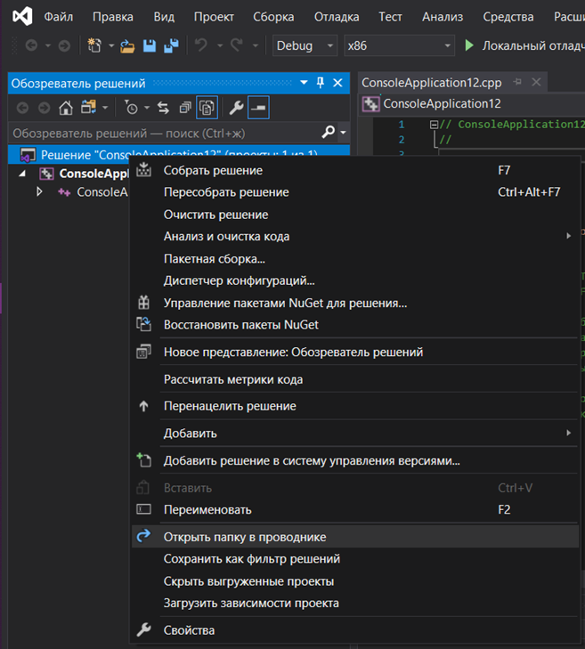

МИНИСТЕРСТВО НАУКИ  И ВЫСШЕГО ОБРАЗОВАНИЯ РОССИЙСКОЙ ФЕДЕРАЦИИ  
Федеральное государственное автономное образовательное учреждение высшего образования  
"КРЫМСКИЙ ФЕДЕРАЛЬНЫЙ УНИВЕРСИТЕТ им. В. И. ВЕРНАДСКОГО"  
ФИЗИКО-ТЕХНИЧЕСКИЙ ИНСТИТУТ  
Кафедра компьютерной инженерии и моделирования
<br/><br/>
### Отчёт по лабораторной работе № 1<br/> по дисциплине "Программирование"
<br/>

студентки 1 курса группы ИВТ-192(1)  
<br/>Николаевой Владимиры Григорьевны
<br/>направления подготовки 09.03.01 "Информатика и вычислительная техника" 

<br/><br/>
<table>
<tr><td>Научный руководитель<br/> старший преподаватель кафедры<br/> компьютерной инженерии и моделирования</td>
<td>(оценка)</td>
<td>Чабанов В.В.</td>
</tr>
</table>
<br/><br/>

Симферополь, 2019

### Цель
Изучить основные возможности создания и отладки программ в IDE MS Visual Studio.
<br/>

### Ход работы

1. **Как создать консольное приложение С++;**

   Нужно открыть `Файл` меню и выбрать `Создать`, `Проект` . 
     
    *Рис. 1*
  
   В появишемся окне выбираем `Консольное приложение с++` .
     
    *Рис. 2*

   Далее настраиваем проект, указывая ему имя и путь, и нажимаем `Создать`.
     
    *Рис. 3*
    <br/>
  
2. **Как изменить цветовую схему (оформление) среды;**

   В меню выбираем вкладку `Средства`. В выпадающем списке выбрать вкладку `Параметры`.
    
    *Рис. 4*
  
   В списке `Цветовая тема` выбрать подходящую тему.
     
    *Рис. 5*
    <br/>
  
3. **Как закомментировать/раскомментировать блок кода средствами MS Visual Studio;**

  Для комментирования блока комментариями используются комбинации `Ctrl + k, c` или `Ctrl + Shift + /`
  Для раскомментирования блока комментариями нужно воспользоваться комбинацией `Ctrl + k, u` или повторным нажатием `Ctrl + Shift +/`
  <br/>

4. **Как открыть в проводнике папку с проектом средствами MS Visual Studio;**

  Открыть обозреватель решений. Щёлкнуть правой кнопкой мыши по проекту. В появившемся контекстном меню выбрать `Открыть папку в проводнике`

  
  *Рис. 6*
  <br/>

5. **Какое расширение файла-проекта используется в MS Visual Studio;**

  В Visual Studio для открытия проекта используется файл `.sln`
  <br/>

6. **Как запустить код без отладки (не менее 2 способов);**

  Во вкладке`Отладка` выбрать `Запустить без отладки`

  Использовать комбинацию `Ctrl + F5`
  <br/>

7. **Как запустить код в режиме отладки (не менее 2 способов);**

  Во вкладке `Отладка` выбрать `Начать отладку`

  Нажать клавишу `F5`
  <br/>

8. **Как установить/убрать точку останова (breakpoint);**

  Выбрать нужную строку и нажать `F9`
  <br/>

9.  **Создаем программу**

    ```cpp
    #include <iostream>
    
    int main() {
    	int i;
    	i = 5;
    	std::cout << i;
    	return 0;
    }
    ```

    

    **Какое значение содержит переменная i в 5й строке?**

    Переменная **i** содержит значение **-858993460**. (т.к. значение переменной не было задано при её объявлении, она содержит "мусор")

    **Какое значение содержит переменная i в 6й строке?**

    Переменная **i** содержит значение **5**.

10.  **Повторяем пункт 9 с изменённым кодом**


    #include <iostream>
    
    int main() {
    	double i;
    	i = 5;
    	std::cout << i;
    	return 0;
    }
    

   **Какое значение содержит переменная i в 5й строке?**

   Переменная **i** содержит значение **-9.2559631349317831e+61** (т.к. значение переменной не было задано при её объявлении, она содержит "мусор")

   **Какое значение содержит переменная i в 6й строке?**

   Переменная **i** содержит значение **5.00000000**
    <br/>

### Вывод
В ходе выполнения лабораторной работы, мной были получены знания по созданию консольных приложений, смены цветового оформления. комментирования кода и многое другое в IDE MS Visual Studio. 
